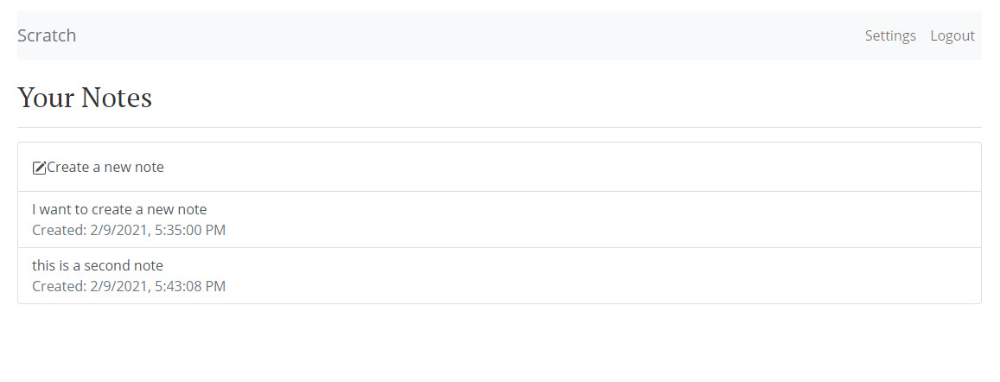

# Note Application - React Front End on Serverless Stack Integrated with Amazon Web Services

## Table of Contents

- **[Description](#Description)**
- **[Installation Requirements](#Installation-Requirements)**
- **[License](#License)**
- **[Questions](#Questions)**

# Description
The note application allows a user to sign-up or sign-In and save notes with file attachments. Sign-up and sign-in are controlled by AWS (Amazon Web Services) Cognito User Pools so users can log-in with their email address. AWS-Amplify is used for user authorization and API connection to backend serverless stack. Notes are saved in AWS DynamoDB and any file attachments are stored in AWS S3 Buckets. The serverless stack repo is found here https://github.com/sallamy2580/mern-note-app 

 ### Deployed Site @ https://mern-note-app-eight.vercel.app/
---
 

# Installation Requirements

1. Clone Note Application in the command line by entering: git clone https://github.com/sallamy2580/mern-note-app.git 

2. Install required libraries from entering in the command line: npm i

3. Update ./src/config.js file with your own AWS information
    - S3: Region and Bucket Name
    - apiGateway: Region and URL
    - Cognito: Region, User pool ID, App Client ID and Identity Pool ID
    - Max Attachment can be left alone
    - Stripe Key

5. Start the application by entering in the command line: npm start

(Instructions are based on having your own Amazon Web Services Services Configured and Seperate Serverless Stack built.) You can view my serverless stack at this repo: https://github.com/sallamy2580/mern-note-app.git 

If you would like to learn how to build this application from scratch, follow this tutorial: https://sallamy2580/mern-note-app.html 
# License

MIT

# Have Questions?

## [Github Profile: github.com/sallamy2580](https://github.com/sallamy2580 "Title")

Please email me at polarisfar7@gmail.com if you have additional questions.
